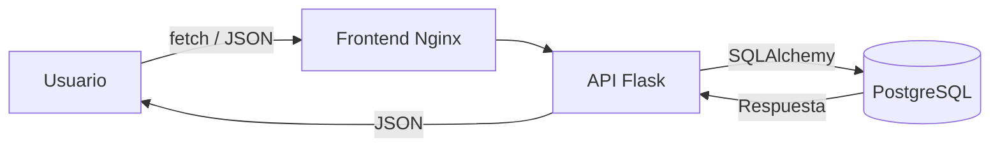

# 🏦 BancoLite

Aplicación bancaria fullstack (educativa) que simula clientes, cuentas y
transferencias, construida con Flask, PostgreSQL y JavaScript vanilla, orquestada
con Docker Compose.


## Tabla de Contenidos

- [Descripción](#descripción)
- [Características](#características)
- [Requisitos Previos](#requisitos-previos)
- [Instalación](#instalación)
- [Configuración](#configuración)
- [Uso](#uso)
- [Arquitectura](#arquitectura)
- [Stack Tecnológico](#stack-tecnológico)
- [API](#api)
- [Testing](#testing)
- [Contribución](#contribución)
- [Troubleshooting](#troubleshooting)
- [Roadmap](#roadmap)
- [Documentación](#documentación)
- [Soporte](#soporte)
- [Versionado](#versionado)
- [Autores](#autores)
- [Licencia](#licencia)

## Descripción

BancoLite es un proyecto **educativo** que muestra, de punta a punta, cómo se
construye una aplicación bancaria mínima: una API REST en Flask que gestiona
clientes, cuentas y transferencias sobre PostgreSQL, y un frontend en JavaScript
vanilla que la consume. Todo el entorno se levanta con un solo comando gracias a
Docker Compose.

> ⚠️ Es un proyecto didáctico: **no incluye autenticación** y no debe desplegarse
> en un entorno público sin endurecerlo. Ver [`docs/architecture/auth.md`](docs/architecture/auth.md).

### Flujo de Funcionamiento



## Características

- ✅ **Gestión de Clientes**: crear y listar clientes (correo único).
- ✅ **Gestión de Cuentas**: crear y listar cuentas asociadas a un cliente.
- ✅ **Transferencias**: transferir entre cuentas con validación de saldo.
- ✅ **API REST**: endpoints JSON con manejo de errores.
- ✅ **Persistencia**: PostgreSQL con volumen Docker.
- ✅ **Interfaz Web**: frontend responsivo en JS vanilla.
- 📋 Autenticación y tests automatizados (ver [Roadmap](#roadmap)).

## Requisitos Previos

- **Docker** y **Docker Compose** (v2).
- Opcional para desarrollo local sin Docker: **Python 3.11+** y **PostgreSQL 15+**.

## Instalación

### 1. Clonar el repositorio

```bash
git clone https://github.com/brayandiazc/bancolife.git
cd bancolife
```

### 2. Configurar variables de entorno

```bash
cp .env.example .env
# Edita .env si necesitas cambiar credenciales o puertos
```

### 3. Levantar la aplicación

```bash
docker-compose up --build
```

## Configuración

Las variables de entorno se documentan en [`.env.example`](.env.example). Cópialo
a `.env` y ajusta los valores.

| Variable            | Descripción                          | Valor por defecto |
| ------------------- | ------------------------------------ | ----------------- |
| `POSTGRES_USER`     | Usuario de PostgreSQL                | `banco_user`      |
| `POSTGRES_PASSWORD` | Contraseña de PostgreSQL             | `banco_password`  |
| `POSTGRES_DB`       | Nombre de la base de datos           | `banco_lite`      |
| `DB_HOST`           | Host de la base (`db` en Compose)    | `db`              |
| `DB_PORT`           | Puerto de la base                    | `5432`            |
| `FLASK_ENV`         | Entorno de Flask                     | `development`     |
| `FLASK_DEBUG`       | Modo debug (`1`/`0`)                 | `1`               |

> Nunca subas tu archivo `.env` con valores reales al repositorio. Ver
> [SECURITY.md](SECURITY.md) y [`docs/conventions/secrets.md`](docs/conventions/secrets.md).

## Uso

Con los contenedores levantados:

- **Frontend**: <http://localhost>
- **API**: <http://localhost:5000>
- **Base de datos**: `localhost:5432`

### Desarrollo local (sin Docker)

```bash
python -m venv venv && source venv/bin/activate
pip install -r backend/requirements.txt
# Asegúrate de tener PostgreSQL corriendo y DB_HOST=localhost en .env
python backend/app.py
```

## Arquitectura

Tres servicios orquestados con Docker Compose (`frontend`, `backend`, `db`).
Detalle completo en [`docs/architecture/architecture.md`](docs/architecture/architecture.md).

```
bancolife/
├── backend/           # API Flask + SQLAlchemy + Pydantic
├── frontend/          # HTML + CSS + JS vanilla (servido por Nginx)
├── docs/              # Documentación del proyecto
├── docker-compose.yml # Orquestación de servicios
└── .env.example       # Contrato de variables de entorno
```

## Stack Tecnológico

- **Backend**: Python 3.11, Flask 3.0, SQLAlchemy 2.0, Pydantic 2.5, Flask-CORS.
- **Frontend**: HTML5, CSS3, JavaScript ES6+, Nginx.
- **Base de datos**: PostgreSQL 15.
- **Infraestructura**: Docker, Docker Compose.

Inventario completo (con versiones y justificación) en
[`docs/architecture/stack.md`](docs/architecture/stack.md).

## API

| Método | Endpoint            | Descripción                    |
| ------ | ------------------- | ------------------------------ |
| GET    | `/clientes`         | Listar clientes                |
| POST   | `/clientes`         | Crear cliente                  |
| GET    | `/clientes/:id`     | Obtener cliente                |
| GET    | `/cuentas`          | Listar cuentas                 |
| POST   | `/cuentas`          | Crear cuenta                   |
| GET    | `/cuentas/:id`      | Obtener cuenta                 |
| GET    | `/transferencias`   | Listar transferencias          |
| POST   | `/transferencias`   | Realizar transferencia         |
| GET    | `/health`           | Estado de la API               |

Contrato completo en [`docs/architecture/api.md`](docs/architecture/api.md).

**Ejemplo — crear un cliente:**

```bash
curl -X POST http://localhost:5000/clientes \
  -H "Content-Type: application/json" \
  -d '{"nombre": "Juan Pérez", "correo": "juan@email.com"}'
```

## Testing

La suite de tests aún no está implementada (ver [Roadmap](#roadmap)). Las
convenciones a seguir están en [`docs/conventions/testing.md`](docs/conventions/testing.md):

```bash
pytest                 # Ejecutar tests (cuando existan)
pytest --cov=backend   # Con reporte de cobertura
```

## Contribución

Lee la [Guía de Contribución](CONTRIBUTING.md) para conocer el flujo Git Flow, los
estándares de código, el formato de commits (Conventional Commits) y el proceso de
Pull Requests.

## Troubleshooting

**Los puertos 80, 5000 o 5432 están ocupados**

```bash
# Detén el proceso que los use o cambia los puertos en docker-compose.yml
docker-compose down
```

**La API no conecta a la base de datos**

```bash
docker-compose logs -f db      # Revisa el estado de PostgreSQL
docker-compose logs -f backend # Revisa el arranque del backend
```

### Obtener ayuda

1. Revisa la [documentación](docs/README.md).
2. Revisa los logs: `docker-compose logs`.
3. Abre un [issue](https://github.com/brayandiazc/bancolife/issues) o escribe a brayandiazc@gmail.com.

## Roadmap

Visión y próximos pasos en [`docs/product/roadmap.md`](docs/product/roadmap.md).

## Documentación

Toda la documentación vive en [`docs/`](docs/README.md):

| Documento                                                                | Responde a                     |
| ------------------------------------------------------------------------ | ------------------------------ |
| [`docs/architecture/architecture.md`](docs/architecture/architecture.md) | ¿Cómo está construido?         |
| [`docs/architecture/stack.md`](docs/architecture/stack.md)               | ¿Con qué tecnologías?          |
| [`docs/architecture/database.md`](docs/architecture/database.md)         | ¿Qué entidades y relaciones?   |
| [`docs/architecture/api.md`](docs/architecture/api.md)                   | ¿Qué endpoints expone?         |
| [`docs/architecture/auth.md`](docs/architecture/auth.md)                 | ¿Cómo se autentica?            |
| [`docs/product/roadmap.md`](docs/product/roadmap.md)                     | ¿Hacia dónde va?               |
| [`docs/decisions/`](docs/decisions/README.md)                            | ¿Por qué cada decisión?        |
| [`docs/conventions/`](docs/conventions/README.md)                        | ¿Cómo trabajamos en este repo? |

## Soporte

¿Problemas o sugerencias? Abre un issue en
[el repositorio](https://github.com/brayandiazc/bancolife/issues) o escribe a
brayandiazc@gmail.com.

## Versionado

Usamos [Git](https://git-scm.com) y seguimos [Semantic Versioning](https://semver.org/).
Consulta las [etiquetas](https://github.com/brayandiazc/bancolife/tags) y el
[CHANGELOG](CHANGELOG.md).

## Autores

- **Brayan Díaz C** — _Trabajo inicial_ — [@brayandiazc](https://github.com/brayandiazc)

## Licencia

Este proyecto está bajo la licencia [MIT](LICENSE).

---

⌨️ con ❤️ por [@brayandiazc](https://github.com/brayandiazc)
