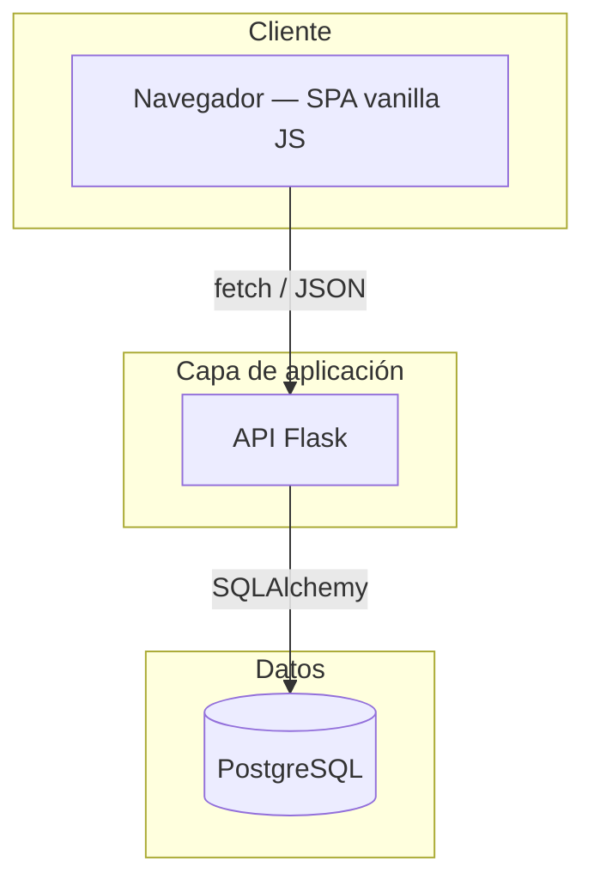
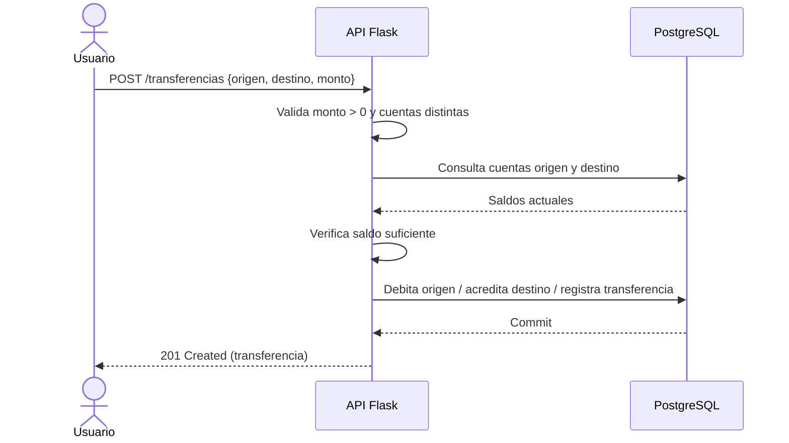

# BancoLite — Arquitectura

> Vista de alto nivel de cómo está construido el sistema y cómo se reparten las
> responsabilidades. Para el stack real (versiones, librerías) ver
> [`stack.md`](stack.md). Para el negocio ver
> [`../product/business-model.md`](../product/business-model.md).
>
> **Última actualización**: 2026-07-02

## Diagrama

BancoLite es una aplicación fullstack de tres contenedores orquestados con
Docker Compose: un frontend estático servido por Nginx, una API REST en Flask y
una base de datos PostgreSQL. No hay capa de autenticación ni workers asíncronos;
el diseño es deliberadamente simple con fines educativos.

## Componentes

| Componente   | Responsabilidad                                                            | Tecnología                  |
| ------------ | ------------------------------------------------------------------------- | --------------------------- |
| **frontend** | Interfaz web (SPA) que consume la API vía `fetch`. Servida como estáticos. | HTML5, CSS3, JS ES6+, Nginx |
| **backend**  | API REST: valida entrada, aplica la lógica de negocio y persiste datos.    | Flask, SQLAlchemy, Pydantic |
| **db**       | Persistencia de clientes, cuentas y transferencias.                        | PostgreSQL 15               |

## Decisiones clave

| Decisión                                     | Razón                                                               |
| -------------------------------------------- | ------------------------------------------------------------------- |
| Tres servicios en Docker Compose             | Aísla responsabilidades y reproduce el entorno con un solo comando. |
| API REST con JSON plano                      | Contrato simple, fácil de consumir desde un frontend vanilla.       |
| Sin autenticación                            | Alcance educativo; reduce complejidad para enfocarse en el CRUD.    |
| SQLAlchemy con creación automática de tablas | Arranque sin migraciones para simplificar el onboarding.            |

> El detalle y las alternativas de cada decisión relevante se registran como
> ADRs en [`../decisions/`](../decisions/README.md).

## Reglas no negociables

- Una transferencia **nunca** debe dejar una cuenta con saldo negativo: se valida
  saldo suficiente antes de aplicar el movimiento.
- El `correo` de un cliente es único en todo el sistema.
- Origen y destino de una transferencia deben ser cuentas distintas y existentes.
- El monto de una transferencia debe ser estrictamente mayor que 0.

## Flujos principales

### Transferencia entre cuentas

## Referencias

- [`stack.md`](stack.md) — stack tecnológico y versiones.
- [`database.md`](database.md) — modelo de datos.
- [`auth.md`](auth.md) — autenticación y autorización.
- [`api.md`](api.md) — contrato de API.
- [`../conventions/`](../conventions/README.md) — convenciones de trabajo.
