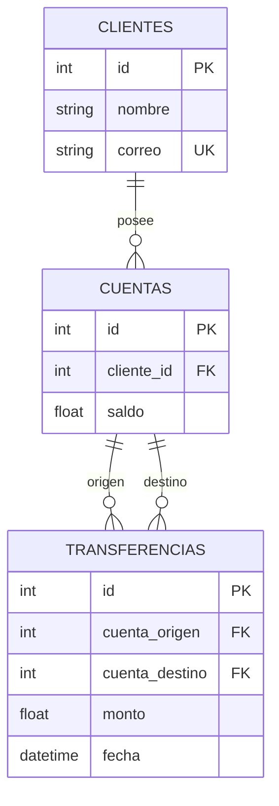

# Modelo de Datos

> Esquema, entidades y relaciones de **BancoLite**.
> Para las **reglas y estándares** de modelado (nomenclatura, tipos, índices)
> ver [`../conventions/database.md`](../conventions/database.md).
>
> **Última actualización**: 2026-07-02

## Diagrama Entidad-Relación

## Entidades principales

### clientes

- **Propósito**: representa a una persona titular de una o más cuentas.
- **Campos clave**: `id` (int, PK), `nombre` (string, requerido), `correo`
  (string, requerido, **único**).
- **Relaciones**: 1:N con `cuentas`.

### cuentas

- **Propósito**: cuenta bancaria con un saldo asociado a un cliente.
- **Campos clave**: `id` (int, PK), `cliente_id` (int, FK → `clientes.id`),
  `saldo` (float, por defecto `0.0`).
- **Relaciones**: N:1 con `clientes`; origen/destino de N `transferencias`.

### transferencias

- **Propósito**: registro histórico de un movimiento de dinero entre dos cuentas.
- **Campos clave**: `id` (int, PK), `cuenta_origen` (int, FK → `cuentas.id`),
  `cuenta_destino` (int, FK → `cuentas.id`), `monto` (float), `fecha`
  (datetime, por defecto `utcnow`).
- **Relaciones**: N:1 con `cuentas` tanto por origen como por destino.

## Relaciones y cardinalidad

| Relación                       | Cardinalidad | Notas                                             |
| ------------------------------ | ------------ | ------------------------------------------------- |
| clientes → cuentas             | 1:N          | Un cliente puede tener varias cuentas.            |
| cuentas → transferencias (org) | 1:N          | Cuenta como origen del movimiento.                |
| cuentas → transferencias (dst) | 1:N          | Cuenta como destino del movimiento.               |

## Índices y restricciones

- `clientes.correo` con restricción **UNIQUE**: no puede repetirse un correo.
- Claves foráneas: `cuentas.cliente_id`, `transferencias.cuenta_origen` y
  `transferencias.cuenta_destino` referencian a sus tablas padre.
- Índices de PK en las tres tablas (`id`).

> Regla de negocio (validada en la capa de aplicación, no por constraint de BD):
> una transferencia requiere saldo suficiente en origen y cuentas distintas.
> Ver [`architecture.md`](architecture.md#reglas-no-negociables).

## Migraciones y versionado del esquema

- No se usa una herramienta de migraciones. Las tablas se crean automáticamente al
  arrancar el backend mediante `Base.metadata.create_all()` (`create_tables()` en
  `backend/db.py`).
- Para un entorno de producción se recomienda introducir migraciones versionadas
  (p. ej. Alembic) — ver [roadmap](../product/roadmap.md).

## Datos semilla (seeds)

- No hay seeds. Los datos se crean vía la API (`POST /clientes`, `POST /cuentas`).
